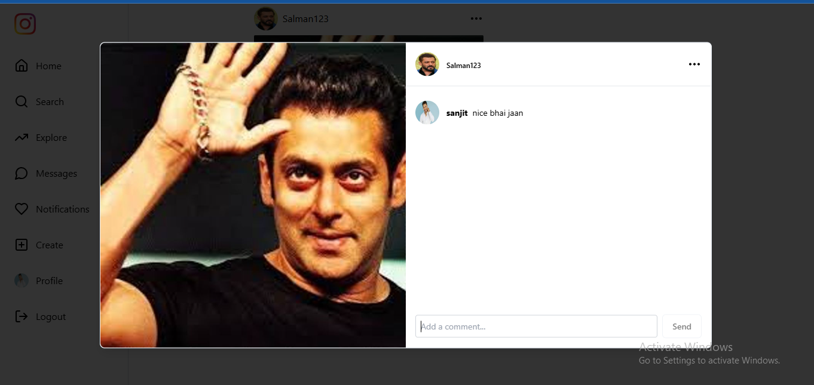
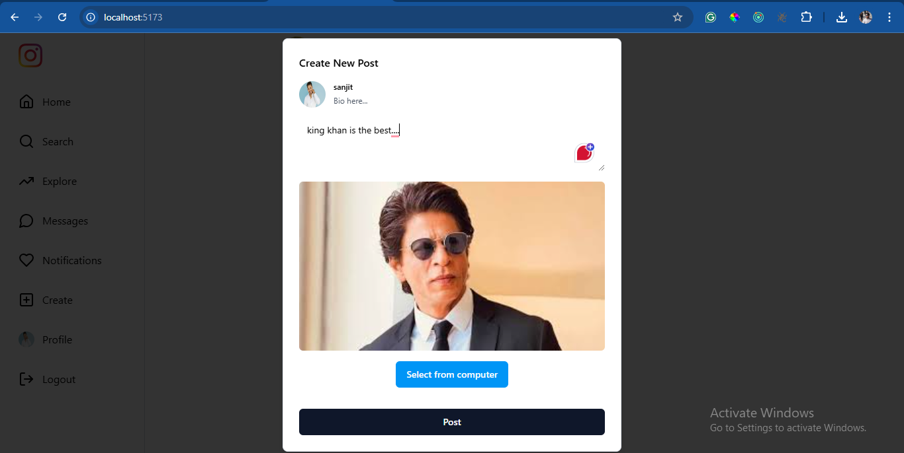
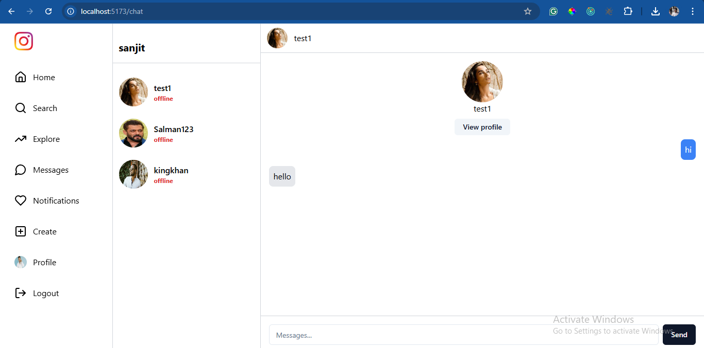
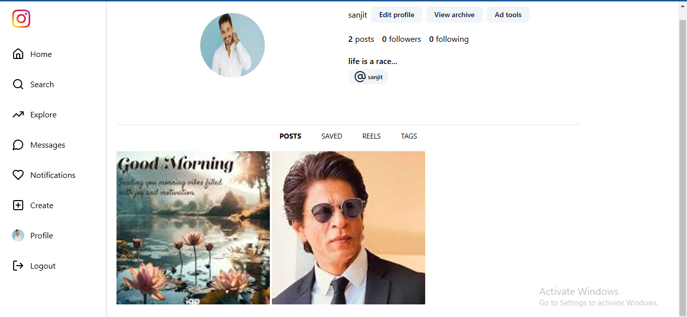
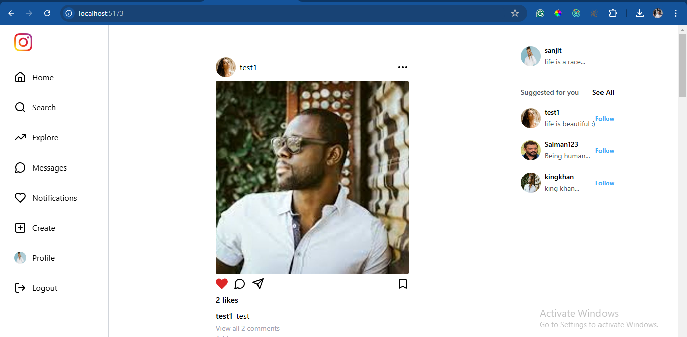
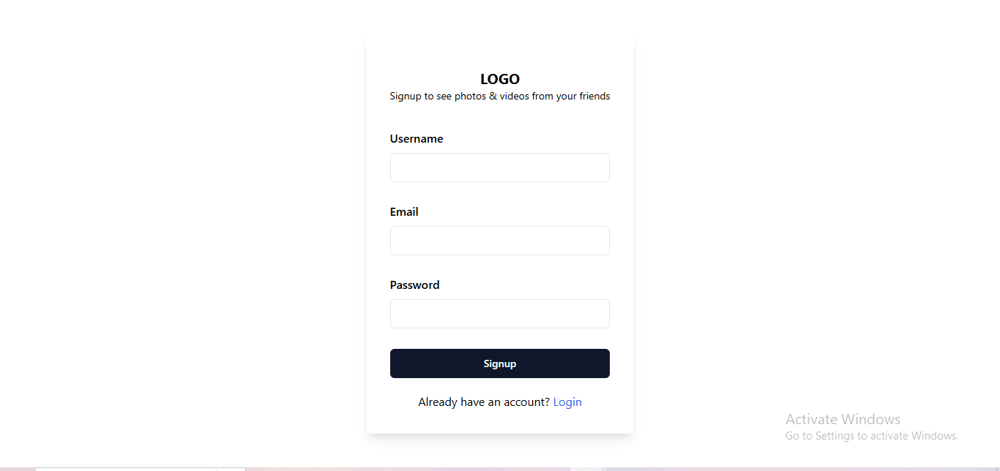

**Project Title:** Snapify - A Modern Social Media Platform

**Description:**  
Snapify is a cutting-edge social media platform that brings people together through the power of visuals and real-time interactions. Built to mimic the core functionalities of Instagram, Snapify allows users to connect, share, and explore through photo and video content. Designed with a sleek, user-friendly interface, Snapify offers an engaging experience with features that encourage meaningful connections and content discovery.

**Key Features:**

- **User Profiles:** Personalized user profiles where users can upload profile pictures, add bios, and showcase their posts.
- **Photo & Video Sharing:** Users can upload photos and videos, add captions, and share their moments with followers.
- **Real-Time Notifications:** Like and comment notifications are delivered instantly, helping users stay engaged with their network.
- **Explore & Trending:** Discover trending posts, popular hashtags, and suggested profiles to follow, making it easy to explore new content.
- **Direct Messaging:** Instant chat feature for one-on-one conversations, complete with message notifications and a read/unread status.
- **Like and Comment System:** Engage with posts by liking and commenting, fostering interaction between users.
- **Stories Feature:** Users can share temporary stories, adding a dynamic way to engage with followers.
- **Secure Authentication:** Account sign-up, login, and authentication with JWT for enhanced security.
- **Responsive Design:** Fully responsive, ensuring a seamless experience on both desktop and mobile devices.

**Tech Stack:**
- **Frontend:** React.js (with Vite), Redux for state management, Tailwind CSS for styling.
- **Backend:** Node.js, Express, and MongoDB.
- **Real-Time Functionality:** Socket.IO for real-time notifications and chat.
- **APIs:** RESTful APIs for user, post, and comment management.
  
Snapify is designed to be highly scalable and customizable, offering a complete social media experience for users to share, connect, and engage.

## Screenshots of the project

Below are screenshots of the application in action:










## Installation

### Frontend (Client)

1. Navigate to the `client` folder:

```bash
   cd client
```

2. Install dependencies:

```bash
    npm install
```

3. Run the frontend (Vite dev server):

```bash
    npm run dev
```

### Backend (Server)

1. Navigate to the server folder:

```bash
    cd server
```

2. Install dependencies:

```bash
    npm install
```

3. Start the backend server:

```bash
   npm run dev
```
